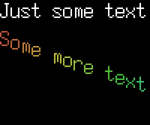
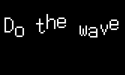

# mpd-visualizer

This is a program primarily for creating videos from MPD, using Lua. It's suitable for using in
a never-ending livestream. However, you can use it without MPD and
create videos offline.

It reads audio data from a file, pipe, or FIFO, and runs one or more Lua scripts
to create a video.

Video is output to a FIFO or pipe as an AVI stream with raw audio and video. This
AVI FIFO can be read by ffmpeg and encoded to an appropriate format. It will refuse
to write the video to a regular file, as its a very, very high bitrate (though
you could always just output to stdout and redirect to a file if you really want
to).

# Usage

```bash
mpd-visualizer \
  -w (width) \
  -h (height) \
  -f (framerate) \
  -r (audio samplerate) \
  -c (audio channels) \
  -s (audio samplesize (in bytes)) \
  -b (number of visualizer bars to calculate) \
  -i /path/to/audio.fifo (or - for stdin) \
  -o /path/to/video.fifo (or - for stdout) \
  -l /path/to/your/lua/scripts/folder \
  -m (1|0) enable/disable mpd polling (default enabled) \
# Following options only valid when -m=0 \
  -t title \
  -a artist \
  -A album \
  -F filename \
  -T totaltime (in seconds) \
  -- optional process to launch

```

## Option details

* `-w (width)`: Video width, ie, `-w 1280`
* `-h (height)`: Video height, ie, `-h 720`
* `-f (framerate)`: Video framerate, ie, `-f 30`
* `-r (samplerate)`: Audio samplerate, in Hz, ie: `-r 48000`
* `-c (channels)`: Audio channels, ie: `-c 2`
* `-s (samplesize)`: Audio samplesize in bytes, ie `-s 2` for 16-bit audio
* `-b (bars)`: number of visualizer bars to calculate
* `-i /path`: Path to your MPD FIFO (or - for stdin)
* `-o /path`: Path to your video FIFO (or - for stdin)
* `-l /path`: Path to folder of Lua scripts
* `-m (1|0)`: Enable/disable MPD polling (default enabled)

If you disable MPD polling, you can manually set a few properties, these
will show up in Lua's `song` object.
*  `-t title`
*  `-a artist`
*  `-A album`
*  `-F filename`
*  `-T totaltime (in seconds)`

Additionally, anything given on the command line after your options
will be launched as a child process, and video data will be input to
its standard input. In this mode, whatever you gave for `-o` is ignored.

This allows you do things like:

```bash
mpd-visualizer \
  -w 1280 \
  -h 720 \
  -f 30 \
  -r 48000 \
  -c 2 \
  -s 2 \
  -b 20 \
  -i /some-fifo \
  -l some-folder \
  -- \
  ffmpeg \
  -re \
  -i pipe:0 \
  -c:v libx264 \
  -c:a aac \
  -strict -2 \
  -f flv rtmp://some-host/whatever
```

This way, you can use MPD's "pipe" output type with mpd-visualizer. So MPD
will launch mpd-visualizer, and mpd-visualizer will launch ffmpeg.

Additional ideas:

**Turn a single song into a video (without MPD)**

```bash
ffmpeg -i some-song.mp3 -f s16le -ac 2 -ar 48000 - | \
mpd-visualizer \
  -w 1280 \
  -h 720 \
  -f 30 \
  -r 48000 \
  -c 2 \
  -s 2 \
  -b 20 \
  -i - \
  -o - \
  -l some-folder \
  -m 0 \
  -t "Some Song" \
  -a "Some Artist" \
  -A "Some Album" \
  -- \
ffmpeg -i pipe:0 -c:v libx264 -c:a aac -strict -2 -y some-file.mp4
```

## Environment variables

`mpd-visualizer` will connect to host `127.0.0.1` on port `6600` without a password.
You can use the `MPD_HOST` and `MPD_PORT` environment variables to override this.

* `MPD_HOST` -- used to connect to hosts besides `127.0.0.1`, or to UNIX sockets.
    * To connect to a UNIX socket, use `MPD_HOST=/path/to/socket`
    * To specify a password, use `MPD_HOST=password@hostname` or `MPD_HOST=password@/path/to/socket`
* `MPD_PORT` -- used to specify a port other than `6600`, ignored if `MPD_HOST` is an absolute path

## Requirements

* LuaJIT or Lua 5.3.
  * This may work with Lua 5.1 or Lua 5.2, so long as you have either Lua BitOp or Bit32, untested
* [FFTW](http://www.fftw.org/)
* [skalibs](http://skarnet.org/software/skalibs/)
* [s6-dns](https://skarnet.org/software/s6-dns/)

## Installation

Hopefully, you can just type `make` and compile `mpd-visualizer`

If you need to customize your compiler, cflags, ldflags, etc
copy `config.mak.dist` to `config.mak` and edit as-needed.

## What happens

When `mpd-visualizer` starts up, it will start reading in audio from the MPD FIFO (or stdin). As
soon as it has enough audio to generate frames of video, it will start doing so. If your
video FIFO does not exist, it will create it (and automatically delete it when it exits).
If the video FIFO already exists, it uses it, and does NOT delete it when it exits.

It also connects to MPD as a client to poll song metadata, it only polls when MPD
reports the song has changed in some way. You can also disable MPD polling entirely.

At startup, it will iterate through your Lua scripts folder and try loading scripts.
Your scripts should return either a Lua function, or a table of functions, like:

```lua
return function()
  print('making video frame')
end
```

Or for the table of functions:

```lua
return {
    onload = function()
      print('loaded!')
    end,
    onreload = function()
      print('reloading!')
    end,
    onframe = function()
      print('making video frame')
    end,
}
```

There's 3 functions that `mpd-visualizer` looks for when you return a table, the only required function is `onframe`.
If you only return a function, it's treated as the `onframe` function.

* `onload()` - this function is called only once, when the script is loaded while `mpd-visualizer` is starting up.
* `onreload()` - whenever `mpd-visualizer` receives a `USR1` signal, it will reload the Lua script and call `onreload()`
* `onframe()` - this function is called every time `mpd-visualizer` wants to make a frame of video.

On every frame, `mpd-visualizer` will calculate a Fast Fourier Transform on the available
audio samples, creating an array of frequencies and amplitudes for Lua. This is useful
for drawing a frequency visualization in your video. It will then call all loaded `onframe` functions
from the loaded Lua scripts.

When it receives a `USR1` signal, it will reload all `Lua` scripts.

`mpd-visualizer` will keep running until either:

* the input audio stream ends
* `mpd-visualizer` receives a `INT` or `TERM` signal.

# The Lua environment

## Globals

Before any script is called, your Lua folder is added to the `package.path` variable,
meaning you can create submodules within your Lua folder and load them using `require`.

Within your Lua script, you have a few pre-defined global variables:

* `stream` - a table representing the video stream
* `image` - a module for loading image files
* `font` - a module for loading BDF fonts
* `file` - a module for filesystem operations
* `song` - a table of what's playing, from MPD.


### The global `stream` object

The `stream` table has two keys:

* `stream.video` - this represents the current frame of video, it's actually an instance of a `frame` which has more details below
  * `stream.video.framerate` - the video framerate
* `stream.audio` - a table of audio data
  * `stream.audio.samplerate` - audio samplerate, like `48000`
  * `stream.audio.channels` - audio channels, like `2`
  * `stream.audio.samplesize` - sample size in bytes, like `2` for 16-bit audio
  * `stream.audio.freqs` - an array of available frequencies, suitable for making a visualizer
  * `stream.audio.amps` - an array of available amplitudes, suitable for making a visualizer
  * `stream.audio.spectrum_len` - the number of available amplitudes/frequencies

### The global `image` object

The `image` module can load most images, including GIFs. All images have a 2-stage loading process. Initially, it
just probes the image for information like height, width, etc. You can then load the image synchronously or asynchronously.
If you're loading images in the `onload` function (that is, at the very beginning of the program's execution), its safe
to load images synchronously. Otherwise, you should load images asynchronously.

* `img = image.new(filename, width, height, channels)`
  * Either filename is required, or `width/height/channels` if you pass `nil` for the filename
  * If filename is given, this will probe an image file. Returns an image object on success, nil on failure
    * If width, height, or channels is 0 or nil, then the image will not be resized or processed
    * If width or height are set, the image will be resized
    * If channels is set, the image will be forced to use that number of channels
      * Basically, channels = 3 for most bitmaps, channels = 4 for transparent images.
    * The actual image data is NOT loaded, use `img:load()` to load data.
  * If filename is nil, then an empty image is created with the given width/height/channels

Scroll down to "Image Instances" for details on image methods like `img:load()`

### The global `font` object

The `font` object can load BDF (bitmap) fonts.

* `f = font.new(filename)`
  * Loads a BDF font and returns a font object

Scroll down to "Font Instances" for details on font methods

### The global `file` object

The `file` object has methods for common file operations:

* `dir = file.ls(path)`
  * Lists files in a directory
  * Returns an array of file objects with two keys:
    * `file` - the actual file path
    * `mtime` - file modification time

* `dirname = file.dirname(path)`
  * Equivalent to the [dirname call](http://pubs.opengroup.org/onlinepubs/009696799/functions/dirname.html)

* `basename = file.basename(path)`
  * Equivalent to the [basename call](http://pubs.opengroup.org/onlinepubs/009696799/functions/basename.html)

* `realpath = file.realpath(path)`
  * Equivalent to the [realpath call](http://pubs.opengroup.org/onlinepubs/009696799/functions/realpath.html)

* `cwd = file.getcwd()`
  * Equivalent to the [getcwd call](http://pubs.opengroup.org/onlinepubs/009695399/functions/getcwd.html)

* `ok = file.exists(path)`
  * Returns `true` if a path exists, `nil` otherwise.

### The global `song` object

The `song` object has metadata on the current song. The only guaranteed key is `elapsed`. Everything else can be nil (if you're connected to MPD, then `file`, `id`, and `total` are also guaranteed).

* `song.file` - the filename of the playing song
* `song.id` - the id of the playing song
* `song.elapsed` - the elapsed time of the current song, in seconds
* `song.total` - the total time of the current song, in seconds
* `song.title` - the title of the current song
* `song.artist` - the artist of the current song
* `song.album` - the album of the current song
* `song.message` - `mpd-visualizer` uses MPD's [client-to-client](https://www.musicpd.org/doc/protocol/client_to_client.html) functionality, It listens on a channel named `visualizer`, if there's a new message on that channel, it will appear here in the song object.

## Image Instances

An image instance has the following methods and properties

* `img.state` - one of `error`, `unloaded`, `loading`, `loaded`, `fixed`
* `img.width` - the image width
* `img.height` - the image height
* `img.channels` - the image channels (3 for RGB, 4 for RGBA)
* `img.frames` - only available after calling `img:load`, an array of one or more frames
* `img.framecount` - only available after calling `img:load`, total number of frames in the `frames` array
* `img.delays` - only available afte calling `img:load` - an array of frame delays (only applicable to gifs)
* `img:load(async)` - loads an image into memory
  * If `async` is true, image is loaded in the background and available on some future iteration of `onframe`
  * else, image is loaded immediately
* `img:unload()` - unloads an image from memory

If `img:load()` fails, either asynchronously or synchronously, then the `state` key will be set to `error`

### Frame instances
Once the image is loaded, it will contain an array of frames. Additionally, `stream.video` is an instance of a `frame`

For convenience, most `frame` functions can be used on the `stream` object directly, instead of `stream.video`, ie,
`stream:get_pixel(x,y)` can be used in place of `stream.video:get_pixel(x,y)`

* `frame.width` - same as `img.width`
* `frame.height` - same as `img.height`
* `frame.channels` - same as `img.channels`
* `frame.state` - all frames are `fixed` images
* `r, g, b, a = frame:get_pixel(x,y)`
  * retrieves the red, green, blue, and alpha values for a given pixel
  * `x,y` starts at `1,1` for the top-left corner of the image
* `frame:set_pixel(x,y,r,g,b,a)` - sets an individual pixel of an image
  * `x,y` starts at `1,1` for the top-left corner of the image
  * `r, g, b` represents the red, green, and blue values, 0 - 255
  * `a` is an optional alpha value, 0 - 255
* `frame:set_pixel_hsl(x,y,r,g,b,a)` - sets a pixel using Hue, Saturation, Lightness
  * `x,y` starts at `1,1` for the top-left corner of the image
  * `h, s, l` represents hue (0-360), saturation (0-100), and lightness (0-100)
  * `a` is an optional alpha value, 0 - 255
* `frame:draw_rectangle(x1,y1,x2,y2,r,g,b,a)` - draws a rectangle from x1,y1 to x2, y2
  * `x,y` starts at `1,1` for the top-left corner of the image
  * `r, g, b` represents the red, green, and blue values, 0 - 255
  * `a` is an optional alpha value, 0 - 255
* `frame:draw_rectangle_hsl(x1,y1,x2,y2,h,s,l,a)` - draws a rectangle from x1,y1 to x2, y2 using hue, saturation, and lightness
  * `x,y` starts at `1,1` for the top-left corner of the image
  * `h, s, l` represents hue (0-360), saturation (0-100), and lightness (0-100)
  * `a` is an optional alpha value, 0 - 255
* `frame:set(frame)`
  * copies a whole frame as-is to the frame
  * the source and destination frame must have the same width, height, and channels values
* `frame:stamp(stamp,x,y,flip,mask,a)`
  * stamps a frame (`stamp`) on top of `frame` at `x,y`
  * `x,y` starts at `1,1` for the top-left corner of the image
  * `flip` is an optional table with the following keys:
    * `hflip` - flip `stamp` horizontally
    * `vflip` - flip `stamp` vertically
  * `mask` is an optional table with the following keys:
    * `left` - mask `stamp`'s pixels left
    * `right` - mask `stamp`'s pixels right
    * `top` - mask `stamp`'s pixels top
    * `bottom` - mask `stamp`'s pixels bottom
  * `a` is an optional alpha value
    * if `stamp is an RGBA image, `a` is only applied for `stamp`'s pixels with >0 alpha
* `frame:blend(f,a)`
  * blends `f` onto `frame`, using `a` as the alpha paramter
* `frame:stamp_string(font,str,scale,x,y,r,g,b,max,lmask,rmask)`
  * renders `str` on top of the `frame`, using `font` (a font object)
  * `scale` controls how many pixels to scroll the font, ie, `1` for the default resolution, `2` for double resolution, etc.
  * `x,y` starts at `1,1` for the top-left corner of the image
  * `r, g, b` represents the red, green, and blue values, 0 - 255
  * `max` is the maximum pixel (width) to render the string at. If the would have gone past this pixel, it is truncated
  * `lmask` - mask the string by this many pixels on the left  (after scaling)
  * `rmask` - mask the string by this many pixels on the right (after scaling)
* `frame:stamp_string_hsl(font,str,scale,x,y,h,s,l,max,lmask,rmask)`
  * same as `stamp_string`, but with hue, saturation, and lightness values instead of red, green, and blue
* `frame:stamp_string_adv(str,props)`
  * renders `str` on top of the `frame`
  * `props` can be a table of per-frame properties, or a function
  * in the case of a table, you need frame 1 defined at a minimum
  * in the case of a function, the function will receive two arguments - the index, and the current properties (may be nil)
* `frame:stamp_letter(font,codepoint,scale,x,y,r,g,b,lmask,rmask,tmask,bmask)`
  * renders an individual letter
  * the letter is a UTF-8 codepoint, NOT a character. Ie, 'A' is 65
  * lmask specifies pixels to mask on the left   (after scaling)
  * rmask specifies pixels to mask on the right  (after scaling)
  * tmask specifies pixels to mask on the top    (after scaling)
  * bmask specifies pixels to mask on the bottom (after scaling)
* `frame:stamp_letter(font,codepoint,scale,x,y,h,s,l,lmask,rmask,tmask,bmask)`
  * same as `stamp_letter`, but with hue, saturation, and lightness values instead of red, green, blue

## Font instances

Loaded fonts have the following properties/methods:

* `f:pixel(codepoint,x,y)`
  * returns true if the pixel at `x,y` is active
  * codepoint is UTF-8 codepoint, ie, 'A' is 65
* `f:pixeli(codepoint,x,y)`
  * same as `pixel()`, but inverted
* `f:get_string_width(str,scale)`
  * calculates the width of a rendered string
  * scale needs to be 1 or greater
* `f:utf8_to_table(str)`
  * converts a string to a table of UTF-8 codepoints

## Examples


### example: square

Draw a white square in the top-left corner:

```lua
return function()
  stream.video:draw_rectangle(1,1,200,200,255,255,255)
end
```

### example: stamp image

Load an image and stamp it over the video

```lua
-- register a global "img" to use
-- globals can presist across script reloads

img = img or nil

return {
    onload = function()
      img = image.new('something.jpg')
      img:load(false) -- load immediately
    end,
    onframe = function()
      stream.video:stamp_image(img.frames[1],1,1)
    end
}
```

### example: load a background

```lua
-- register a global 'bg' variable
bg = bg or nil

return {
    onload = function()
      bg = image.new('something.jpg',stream.video.width,stream.video.height,stream.video.channels)
      bg:load(false) -- load immediately
      -- image will be resized to fill the video frame
    end,
    onframe = function()
      stream.video:set(bg)
    end
}
```

### example: display song title

```lua
-- register a global 'f' to use for a font
f = f or nil

return {
    onload = function()
      f = font.new('some-font.bdf')
    end,
    onframe = function()
      if song.title then
          stream.video:stamp_string(f,song.title,3,1,1)
          -- places the song title at top-left (1,1), with a 3x scale
      end
    end
}
```

### example: draw visualizer bars

```lua
return {
    onframe = function()
        -- draws visualizer bars
        -- each bar is 10px wide
        -- bar height is between 0 and 90
        for i=1,stream.audio.spectrum_len,1 do
            stream.video:draw_rectangle((i-1)*20, 680 ,10 + (i-1)*20, 680 - (ceil(stream.audio.amps[i])) , 255, 255, 255)
        end

    end
}
```

### example: animate a gif

```lua
local frametime = 1000 / stream.video.framerate
-- frametime is how long each frame of video lasts in milliseconds
-- we'll use this to figure out when to advance to the next
-- frame of the gif

-- register a global 'gif' variable
gif = gif or nil

return {
    onload = function()
      gif = image.new('agif.gif')
      gif:load(false) -- load immediately

      -- initialize the gif with the first frame and frametime
      gif.frameno = 1
      gif.nextframe = gif.delays[gif.frameno]
    end,
    onframe = function()
      stream.video:stamp_image(gif.frames[gif.frameno],1,1)
      gif.nextframe = gif.nextframe - frametime
      if gif.nextframe <= 0 then
          -- advance to the next frame
          gif.frameno = gif.frameno + 1
          if gif.frameno > gif.framecount then
              gif.frameno = 1
          end
          gif.nextframe = gif.delays[gif.frameno]
      end
    end
}
```

### example: use `stamp_string_adv` with a function to generate a rainbow

```lua
local vga

local colorcounter = 0
local colorprops = {}

local function cycle_color(i, props)
  if i == 1 then
    -- at the beginning of the string, increase our color counter
    colorcounter = colorcounter + 1
    props = {
      x = 1,
    }
  end
  if colorcounter == 36 then
    -- one cycle is 30 degrees
    -- we move 10 degrees per frame, so 36 frames for a full cycle
    colorcounter = 0
  end
  
  -- use the color counter offset + i to change per-letter colors
  local r, g, b = image.hsl_to_rgb((colorcounter + (i-1) ) * 10, 50, 50)

  -- also for fun, we make each letter drop down
  return {
    x = props.x,
    y = 50 + i * (vga.height/2),
    font = vga,
    scale = 3,
    r = r,
    g = g,
    b = b,
  }
end

local function onload()
  vga = font.load('demos/fonts/7x14.bdf')
end

local function onframe()
  stream:stamp_string(vga, "Just some text", 3, 1, 1, 255, 255, 255)
  stream:stamp_string_adv("Some more text", cycle_color )
end

return {
  onload = onload,
  onframe = onframe,
}
```

Output:



### example: use `stamp_string_adv` with a function to do the wave

```lua
local vga
local sin = math.sin
local ceil = math.ceil

local sincounter = -1
local default_y = 30
local wiggleprops = {}

local function wiggle_letters(i, props)
  if i == 1 then
    sincounter = sincounter + 1
    props = {
      x = 10,
    }
  end
  if sincounter == (26) then
    sincounter = 0
  end

  return {
    x = props.x,
    y = default_y + ceil( sin((sincounter / 4) + i - 1) * 10),
    font = vga,
    scale = 3,
    r = 255,
    g = 255,
    b = 255,
  }
end

local function onload()
  vga = font.load('demos/fonts/7x14.bdf')
end

local function onframe()
  stream:stamp_string_adv("Do the wave", wiggle_letters )
end

return {
  onload = onload,
  onframe = onframe,
}
```

Output:



## License

Unless otherwise stated, all files are released under
an MIT-style license. Details in `LICENSE`

Some exceptions:

* `src/ringbuf.h` and `src/ringbuf.c` - retains their original licensing,
-see `LICENSE.ringbuf` for full details.
* `src/tinydir.h` - retains original licensing (simplified BSD), details found
within the file.
* `src/stb_image.h` and `src/stb_image_resize.h` - remains in the public domain
* `src/thread.h` - available under an MIT-style license or Public Domain, see file
for details.

## Known users

* [Game That Tune's 24/7 VGM Stream](https://youtube.com/gamethattune)
